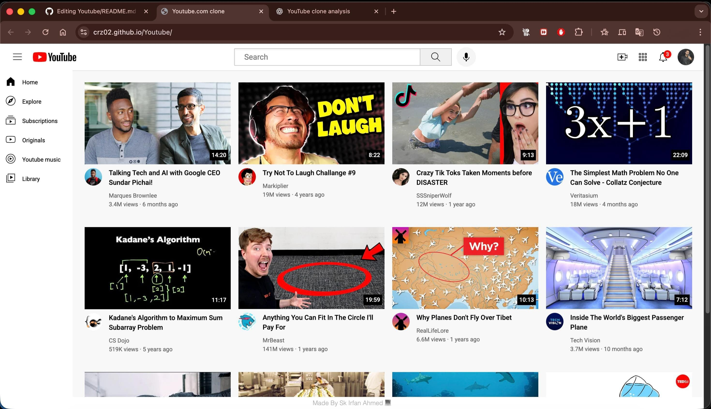

# YouTube-Clone 🎥

This is a simple **YouTube homepage clone** built using HTML and CSS. It mimics the layout and design of the original YouTube homepage for learning and educational purposes.[This Code is Broken Down Due to HTML4 Nad INHTML Scripts **ITS CONTAINS Sooo many bugs**]



## 🌐 Live Demo

Check it out here: [https://crz02.github.io/Youtube/](https://crz02.github.io/Youtube/)

---

## 📁 Project Structure

Youtube/
├── index.html
├── style.css
├── images/
│ └── (thumbnails, logos, etc.)


---

## 🚀 Features

- YouTube-style homepage layout
- Responsive design (if applicable)
- Clickable video thumbnails (linked to actual YouTube videos)
- Hover effects and styling similar to YouTube

---

## 📚 Technologies Used

- HTML5
- CSS3

---

## 📌 Notes

> This project is **not affiliated with YouTube** or Google. It is intended purely for educational purposes to practice front-end development skills.

---


## 🛠️ How to Use

1. Clone this repo:

   ```bash
   git clone https://github.com/crz02/Youtube.git

